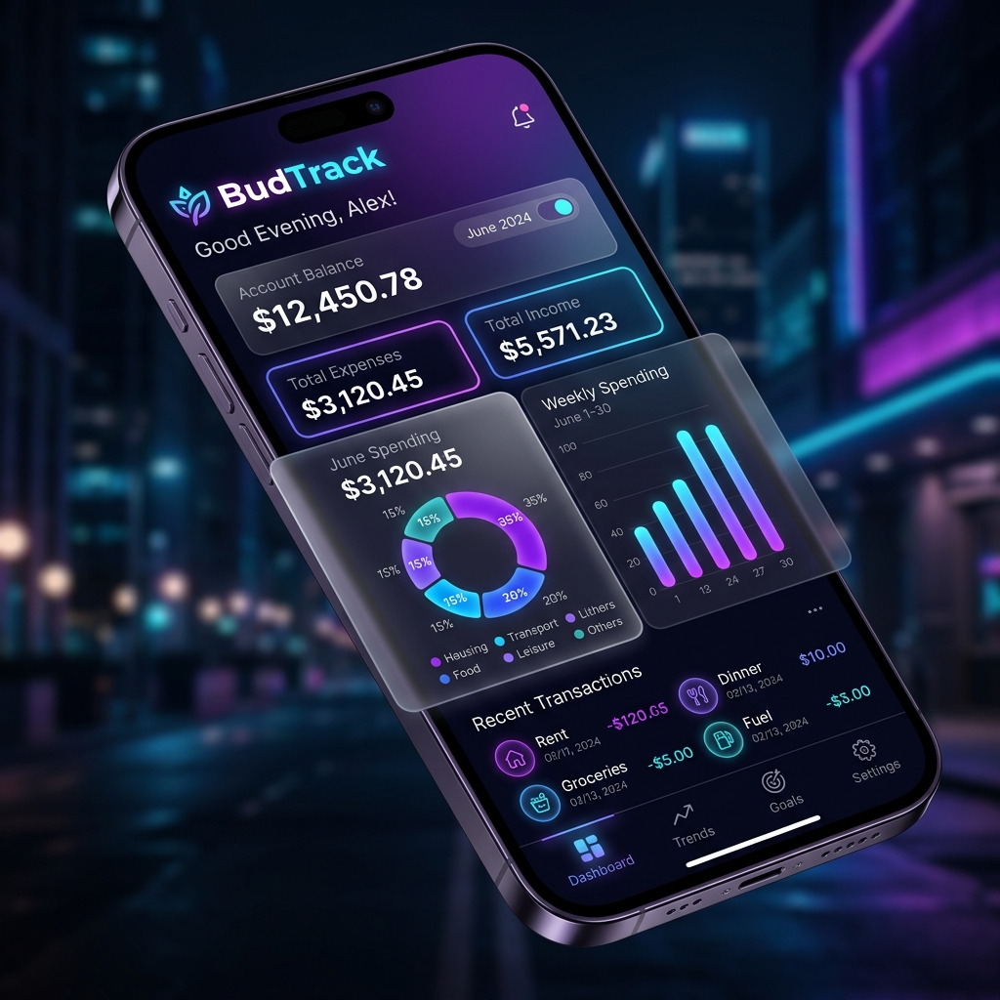

# 💰 BudTrack — Smart Budget Tracker



**BudTrack** is an industrial-grade, industrial-level personal finance management application designed for the modern user. Built with a focus on high-end aesthetics, smooth animations, and AI-driven insights, it transforms the tedious task of budget tracking into a premium, interactive experience.

---

## ✨ Key Features

-   **🚀 Professional Onboarding**: A seamless 3-step setup process to personalise your experience with your name, monthly budget, and starting period.
-   **📊 Real-time Dashboard**: Track your daily allowance, today's spending, and budget percentage at a glance.
-   **🤖 AI Insights**: Get intelligent, contextual feedback on your spending habits powered by smart logic.
-   **🍩 Detailed Analytics**: Visualise your spending via Ring charts, Bar charts, and Donut charts for category breakdowns.
-   **🔁 Recurring Expenses**: Manage subscriptions and bills with automated tracking and toggle-based activation.
-   **📈 Industrial Reports**: Generate comprehensive monthly reports with financial verdicts, top expenses, and AI recommendations.
-   **🎨 Premium Themes**: Choose from multiple design paradigms including "Aurora Glass," "Nordic Clean," and "Money Mood."
-   **📱 Mobile Ready**: Built with Capacitor v6, supporting native Android features like splash screens and status bar customisation.
-   **🛡️ Privacy First**: Local-first data management with easy CSV export and account clearing options.

---

## 🛠️ Tech Stack

-   **Frontend**: Semantic HTML5, Vanilla JavaScript (ES6+), Premium CSS3 (Glassmorphism & Flexbox/Grid).
-   **Visualisation**: [Chart.js](https://www.chartjs.org/) for high-performance financial charts.
-   **Mobile Engine**: [Capacitor v6](https://capacitorjs.com/) for native Android deployment.
-   **Typography**: Inter & Outfit (Google Fonts) for a modern, sleek look.

---

## 🚀 Getting Started

### Prerequisites

-   [Node.js](https://nodejs.org/) (LTS recommended)
-   [npm](https://www.npmjs.com/)

### Installation

1.  **Clone the repository:**
    ```bash
    git clone https://github.com/Mustaq47/Budget-Tracker-.git
    cd Budget-Tracker-
    ```

2.  **Install dependencies:**
    ```bash
    npm install
    ```

3.  **Run locally:**
    Simply open `budtrack_app.html` in your browser, or use a local dev server:
    ```bash
    npx serve .
    ```

### Mobile Deployment (Android)

1.  **Add Android platform:**
    ```bash
    npx cap add android
    ```

2.  **Sync web assets:**
    ```bash
    npx cap sync
    ```

3.  **Open in Android Studio:**
    ```bash
    npx cap open android
    ```

---

## 📸 Design Philosophy

BudTrack follows "Industrial Glassmorphism" principles:
-   **Vibrant Gradients**: Deep purples and blues for a premium financial feel.
-   **Dynamic Animations**: Smooth transitions for keypad toggles and screen switches.
-   **Contextual UI**: Interactive elements like the pull-down keypad for a mobile-first gesture experience.

---

## 📄 License

This project is licensed under the **ISC License**.

---

*Crafted with ❤️
